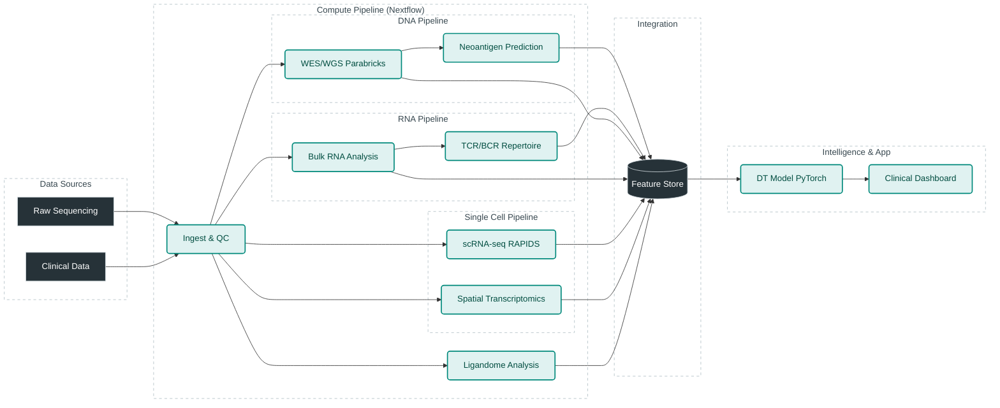

# Infra Requirements: MHC-centric Digital Twin for Oncology

This repository serves as the central technical requirements and proposal document for building a scalable, cloud-agnostic data pipeline for Neoantigen Digital Twins. The goal is to define the infrastructure, software, and architecture required to execute this pipeline at scale, matching or exceeding the standards of frontier biotech companies.

## 1. Objectives

*   **a) Developer Experience**: Define a top-tier development environment (AntiGravity IDE, Google Workspace, Gemini).
*   **b) Cloud-Agnostic Architecture**: Design a data pipeline that runs on any major cloud (AWS/GCP/Azure) using containerization and orchestration standards.
*   **c) Startup Efficiency**: Maximize use of Cloud Startup credits and initiatives to minimize initial run costs.
*   **d) GPU Acceleration**: Leverage GPU acceleration (NVIDIA Parabricks, RAPIDS) at every possible step to reduce time-to-insight.
*   **e) Frontier Standards**: Architecture that aligns with or exceeds current industry best practices (e.g., Moderna, BioNTech digital twin approaches).
*   **f) Research-Driven**: Integrate design choices and novel methods proposed in recent research papers.

---

## 2. Architecture Design

The architecture is designed to be **Cloud-Agnostic** by relying on:
1.  **Containerization**: Docker/Singularity for all tools.
2.  **Orchestration**: Nextflow (supports AWS Batch, Google Batch, Azure Batch, and K8s).
3.  **Storage Abstraction**: S3-compatible object storage for data, POSIX-compliant shared file systems for high-performance computing (HPC) steps.

### High-Level Architecture

### Strategic Design Choices
1.  **GPU over CPU**: We prioritize GPU-accelerated tools (Parabricks, RAPIDS) to reduce compute time from days to hours. This creates a "burst" cost model that is often cheaper than long-running CPU instances on Spot markets.
2.  **Feature Store**: A dedicated Feature Store (e.g., Feast) is used to decouple the raw data processing pipelines from the downstream Digital Twin modeling, allowing the ML team to iterate faster.

---

## 3. Pipeline Steps & Infrastructure Explanation

Detailed analysis of each step is available in `pipeline/pipeline.md` and `research/research_papers_analysis.md`.

| Step | Data Source | Primary Tool (Infra) | Scaling Requirement | Citation/Reason |
| :--- | :--- | :--- | :--- | :--- |
| **1. Ingestion** | Clinical/EHR | **Polars/DuckDB** (CPU) | Low (Memory efficient) | `pipeline.md`: Lightweight analytics for metadata. |
| **2. WES/WGS** | FASTQ | **NVIDIA Parabricks** (A100 GPU) | **High** (GPU) | `pipeline.md`: Parabricks reduces WGS from 30h to <1h. |
| **3. Bulk RNA** | FASTQ | **STAR / Salmon** (High-Mem CPU) | Medium (Memory) | Biologist preference for STAR accuracy. |
| **4. Neoantigen** | VCF/RNA | **MHCflurry 2.0** (GPU) | Medium (GPU) | `gkae1092.pdf`: Validated on IEDB 2024 data. |
| **5. TCR/BCR** | RNA/Seq | **MiXCR** (CPU) / **ISPIPab** | Medium | `btae556.pdf`: Adds B-cell epitope prediction. |
| **6. scRNA-seq** | scFASTQ | **RAPIDS / Scanpy** (GPU) | **High** (GPU RAM) | `pipeline.md`: RAPIDS accelerates 10x cell clustering. |
| **7. Spatial** | Visium/Img | **Squidpy / cuCIM** (GPU) | **High** (GPU) | `pipeline.md`: cuCIM needed for large WSI images. |
| **8. Ligandome** | MassSpec | **AlphaPeptDeep** (GPU) | Medium | Validates predictions against physical binding. |
| **9. Integration**| Multi-omics | **Graph Neural Networks** (GPU) | **Extreme** (VRAM) | `2503.17666v1.pdf`: GNNs for multi-modal binding. |

---

## 4. Developer Infrastructure Requirements

To enable a world-class engineering environment, we mandate the following stack:

### **IDE & Productivity**
*   **AntiGravity IDE**: The primary development environment. It provides AI-native coding assistance, context awareness, and integrated terminal/browser tools essential for managing complex infra code.
*   **Google Workspace + Gemini**: For documentation, collaboration, and email. Gemini Advanced is utilized for summarizing research papers and drafting documentation.

### **DevOps & CI/CD**
*   **GitHub**: Source of truth. Actions for CI/CD.
*   **Docker Desktop / Orbit**: For local container testing.
*   **Tower.nf / Nextflow Tower**: For monitoring pipeline runs locally and in the cloud.

---

## 5. Cost Analysis (Estimates)

*Note: Based on typical "Startup" usage patterns (e.g., 100 samples/month).*

| Component | Estimated Cost (Monthly) | Optimization Strategy |
| :--- | :--- | :--- |
| **Storage (S3/GCS)** | $200 - $500 | Lifecycle policies (Archive Cold Storage after 30 days). |
| **Compute (Spot GPU)** | $1,000 - $3,000 | Use Spot instances; Parabricks finishes fast, reducing uptime. |
| **Compute (Head Node)**| $50 - $100 | Run Nextflow head node on tiny instance. |
| **Dev Environment** | $100/user | AntiGravity/Gemini subscriptions. |
| **Total** | **~$1,500 - $4,000** | **Offset by Cloud Startup Credits (usually \$100k+).** |

**Recommendation**: Apply for **AWS Activate** or **Google Build** program immediately to cover these costs for 12-24 months.

---

## 6. Roadmap

### **Phase 1: Foundation (Weeks 1-4)**
*   [ ] Set up GitHub Repo & CI/CD.
*   [ ] Configure Cloud Accounts (AWS/GCP) & Apply for Credits.
*   [ ] Build Docker containers for Step 2 (Parabricks) and Step 4 (MHCflurry).
*   [ ] Test "Hello World" Nextflow pipeline locally.

### **Phase 2: Core Pipeline (Weeks 5-12)**
*   [ ] Implement WES/WGS -> VCF pipeline.
*   [ ] Implement RNA-seq -> Expression pipeline.
*   [ ] Integrate MHCflurry for Neoantigen prediction.
*   [ ] Validate against public datasets (TCGA samples).

### **Phase 3: Digital Twin Integration (Weeks 13-24)**
*   [ ] Build Feature Store.
*   [ ] Implement Graph Neural Network (GNN) model (`MuLAAIP` architecture).
*   [ ] Develop Clinical Dashboard for visualization.

### **Phase 4: Scale & Spatial (Weeks 24+)**
*   [ ] Add Spatial Transcriptomics module.
*   [ ] Optimize for multi-cloud burst compute.
*   [ ] FDA/Compliance readiness (HIPAA audit).