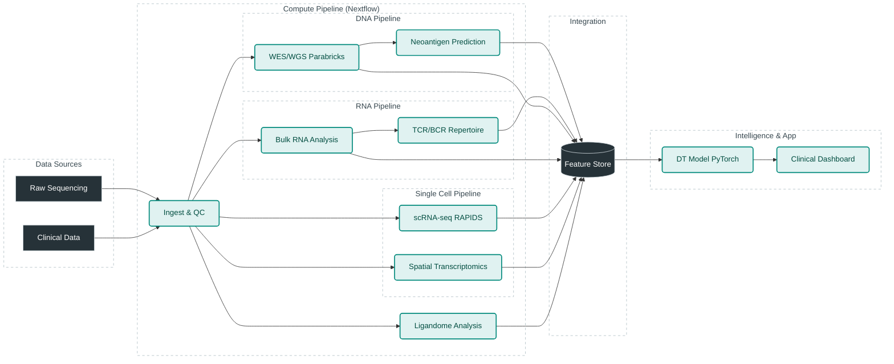

# Infra Requirements: MHC-centric Digital Twin for Oncology

This repository serves as the central technical requirements and proposal document for building a scalable, cloud-agnostic data pipeline for Neoantigen Digital Twins. The goal is to define the infrastructure, software, and architecture required to execute this pipeline at scale, matching or exceeding the standards of frontier biotech companies.

## 1. Objectives

*   **a) Developer Experience**: Define a top-tier development environment (AntiGravity IDE, Google Workspace, Gemini).
*   **b) Cloud-Agnostic Architecture**: Design a data pipeline that runs on any major cloud (AWS/GCP/Azure) using containerization and orchestration standards.
*   **c) Startup Efficiency**: Maximize use of Cloud Startup credits and initiatives to minimize initial run costs.
*   **d) GPU Acceleration**: Leverage GPU acceleration (NVIDIA Parabricks, RAPIDS) at every possible step to reduce time-to-insight.
*   **e) Frontier Standards**: Architecture that aligns with or exceeds current industry best practices (e.g., Moderna, BioNTech digital twin approaches).
*   **f) Research-Driven**: Integrate design choices and novel methods proposed in recent research papers.

---

## 2. Literature Review & Industry Benchmarks

To ensure this pipeline remains at the cutting edge, we have analyzed both academic literature and the technical stacks of frontier biotech companies. This "Literature Review" informs our architectural decisions.

### A. Research Papers Analysis
*   **IEDB 2024 Update (`gkae1092`)**: Confirms that high-quality, curated datasets are the bedrock of any predictive model.
    *   *Decision*: We will use **MHCflurry 2.0** as our primary predictor because it is retrainable on these latest IEDB datasets, avoiding the stagnation of static, pre-trained models.
*   **Antibody-Antigen Interaction (`btae556`, `2503.17666v1`)**: Recent papers like **ISPIPab** and **MuLAAIP** highlight the shift towards **B-cell/Antibody** prediction and **Multi-Modal Learning** (Sequence + Structure).
    *   *Decision*: Our architecture includes a **Graph Neural Network (GNN)** module in the "Intelligence Layer" to support these emerging structure-based models, moving beyond simple sequence alignment.

### B. Frontier Industry Standards
Leading companies have moved beyond simple "binding affinity" filters toward full-system simulation:

| Company | Key Tech / Approach | Insight for Our Pipeline |
| :--- | :--- | :--- |
| **NEC Bio** | **NeoAgDT (Digital Twin)** | Moves beyond ranking to *optimizing* vaccine composition using simulation. |
| **BioNTech** | **DeepChain™ (RL)** | Uses Reinforcement Learning to "engineer" immunogenicity. |
| **Turbine AI** | **Simulated Cells™** | Simulates cell signaling to predict resistance (HLA loss). |
| **Gritstone** | **EDGE™ (Ligandome)** | Uses Mass Spec (Ligandome) data as the "Ground Truth" for training. |

### C. Synthesized Conclusions
These findings dictate three core requirements for our `infra-requirements`:
1.  **Dynamic Simulation**: We cannot rely on static scripts. We need an "Intelligence Layer" (Digital Twin Model) that can simulate testing.
2.  **Ligandome Validation**: Mass Spectrometry (Step 8) is not optional; it is the only way to generate "Ground Truth" data like Gritstone.
3.  **Heterogeneity**: We must model the tumor as a population. Single-cell data (Step 6) is critical to understanding which clones are presenting antigens.

---

## 3. Architecture Design

The architecture follows a **Hybrid Cloud Strategy** to leverage the unique strengths of both AWS and GCP, ensuring maximum performance for both bioinformatics and AI:

### **Hybrid Platform Split**
1.  **AWS (Primary Analysis Layer)**:
    - **Service**: **AWS HealthOmics** for managed Nextflow orchestration (Steps 1-4).
    - **Purpose**: High-throughput variant calling (WES/WGS) and transcriptomics.
    - **Optimization**: Uses sequence-aware compression to reduce storage costs by 40%.
2.  **GCP (Intelligence & Digital Twin Layer)**:
    - **Service**: **Vertex AI** and **TPUs/A100s** for Steps 6-9.
    - **Purpose**: Training custom Graph Neural Networks (GNNs) and foundation models for MHC prediction.
    - **Analytics**: **BigQuery** for cohort-level longitudinal data mining.

### **Core Components**
1.  **Containerization**: Docker/Singularity for all tools ensures cross-cloud portability.
2.  **Orchestration**: Nextflow (supports AWS Batch/HealthOmics and GCP Batch as distinct profiles).
3.  **Data Ingestion**: Automated transfer of processed VCF/Expression data from AWS storage to GCP Vertex AI for downstream modeling.

### High-Level Architecture

### Strategic Design Choices
1.  **GPU over CPU**: We prioritize GPU-accelerated tools (Parabricks, RAPIDS) to reduce compute time from days to hours. This creates a "burst" cost model that is often cheaper than long-running CPU instances on Spot markets.
2.  **Feature Store**: A dedicated Feature Store (e.g., Feast) is used to decouple the raw data processing pipelines from the downstream Digital Twin modeling, allowing the ML team to iterate faster.

---

## 4. Pipeline Steps & Infrastructure Explanation

Detailed analysis of each step is available in `pipeline/pipeline.md` and `research/research_papers_analysis.md`.

| Step | Data Source | Primary Tool (Infra) | Scaling Requirement | Citation/Reason |
| :--- | :--- | :--- | :--- | :--- |
| **1. Ingestion** | Clinical/EHR | **Polars/DuckDB** (CPU) | Low (Memory efficient) | `pipeline.md`: Lightweight analytics for metadata. |
| **2. WES/WGS** | FASTQ | **NVIDIA Parabricks** (A100 GPU) | **High** (GPU) | `pipeline.md`: Parabricks reduces WGS from 30h to <1h. |
| **3. Bulk RNA** | FASTQ | **STAR / Salmon** (High-Mem CPU) | Medium (Memory) | Biologist preference for STAR accuracy. |
| **4. Neoantigen** | VCF/RNA | **MHCflurry 2.0** (GPU) | Medium (GPU) | `gkae1092.pdf`: Validated on IEDB 2024 data. |
| **5. TCR/BCR** | RNA/Seq | **MiXCR** (CPU) / **ISPIPab** | Medium | `btae556.pdf`: Adds B-cell epitope prediction. |
| **6. scRNA-seq** | scFASTQ | **RAPIDS / Scanpy** (GPU) | **High** (GPU RAM) | `pipeline.md`: RAPIDS accelerates 10x cell clustering. |
| **7. Spatial** | Visium/Img | **Squidpy / cuCIM** (GPU) | **High** (GPU) | `pipeline.md`: cuCIM needed for large WSI images. |
| **8. Ligandome** | MassSpec | **AlphaPeptDeep** (GPU) | Medium | Validates predictions against physical binding. |
| **9. Integration**| Multi-omics | **Graph Neural Networks** (GPU) | **Extreme** (VRAM) | `2503.17666v1.pdf`: GNNs for multi-modal binding. |

---

## 5. Developer Infrastructure Requirements

To enable a world-class engineering environment, we mandate the following stack:

### **IDE & Productivity**
*   **AntiGravity IDE**: The primary development environment. It provides AI-native coding assistance, context awareness, and integrated terminal/browser tools essential for managing complex infra code.
*   **Google Workspace + Gemini**: For documentation, collaboration, and email. Gemini Advanced is utilized for summarizing research papers and drafting documentation.

### **DevOps & CI/CD**
*   **GitHub**: Source of truth. Actions for CI/CD.
*   **Docker Desktop / Orbit**: For local container testing.
*   **Tower.nf / Nextflow Tower**: For monitoring pipeline runs locally and in the cloud.

---

## 6. Cost Analysis (Estimates)

*Note: Based on typical "Startup" usage patterns (e.g., 100 samples/month).*

| Component | Estimated Cost (Monthly) | Optimization Strategy |
| :--- | :--- | :--- |
| **Storage (S3/GCS)** | $200 - $500 | Lifecycle policies (Archive Cold Storage after 30 days). |
| **Compute (Spot GPU)** | $1,000 - $3,000 | Use Spot instances; Parabricks finishes fast, reducing uptime. |
| **Compute (Head Node)**| $50 - $100 | Run Nextflow head node on tiny instance. |
| **Dev Environment** | $100/user | AntiGravity/Gemini subscriptions. |
| **Total** | **~$1,500 - $4,000** | **Offset by Cloud Startup Credits (usually \$100k+).** |

**Recommendation**: Apply for **AWS Activate** or **Google Build** program immediately to cover these costs for 12-24 months.

---

## 6.5 Cloud & AI Startup Incentive Programs

To maximize cost efficiency, we will leverage major startup programs from cloud providers and AI platforms. These programs can provide **$600k - $1.5M** in credits, effectively covering 12-24 months of infrastructure costs.

### AWS Activate
**Standard Benefits** (for startups with VC/accelerator partnerships):
- Up to **$100,000 USD** in AWS credits
- Technical support and training
- **Application**: Through Activate Provider or direct

**2025 Generative AI Accelerator** (highly competitive):
- Up to **$1,000,000 USD** in credits
- Personalized AI/ML mentorship
- Biotech/pharma use cases prioritized

### NVIDIA Inception
**Core Program Benefits**:
- **10,000 inference credits** on ai.nvidia.com
- Preferential pricing on **NVIDIA AI Enterprise** (includes Clara for life sciences)
- Early access to **BioNeMo** for drug discovery
- VC Alliance and Healthcare Partner connections

**NVIDIA + Microsoft Partnership**:
- Additional **$150,000 USD** in Azure credits for healthcare/life sciences startups

### Google for Startups Cloud Program
**AI-First Startups**:
- Up to **$350,000 USD** in GCP credits over 2 years
- Dedicated AI training and technical support

**Standard Track** (Pre-Seed to Series A):
- Year 1: Up to **$100,000 USD**
- Year 2: Additional 20% coverage (up to **$100,000 USD**)

### Implementation Strategy
1.  **Immediate**: Apply to AWS Activate and Google for Startups AI-First track
2.  **Week 2**: Enroll in NVIDIA Inception
3.  **Quarter 2**: Target AWS Gen AI Accelerator for next cohort

**Expected Total**: **$600,000 - $1,500,000** in cloud credits (details in [`infrastructure/startup_incentives.md`](file:///Users/vineethkalluru/Documents/infra-requirements/infrastructure/startup_incentives.md))

---

## 7. Roadmap

### **Phase 1: Foundation (Weeks 1-4)**
*   [ ] Set up GitHub Repo & CI/CD.
*   [x] Configure **AWS HealthOmics** & Apply for Activate Credits ($100k).
*   [x] Configure **GCP Vertex AI** & Apply for AI-First Credits ($350k).
*   [ ] Build Docker containers for Step 2 (Parabricks) on AWS.
*   [ ] Test "Hello World" Nextflow pipeline on AWS HealthOmics.

### **Phase 2: Primary Pipeline - AWS (Weeks 5-12)**
*   [ ] Implement WES/WGS -> VCF pipeline on AWS.
*   [ ] Implement RNA-seq -> Expression pipeline on AWS.
*   [ ] Integrate MHCflurry for Neoantigen prediction.
*   [ ] Set up automated data sync for processed files to GCP.

### **Phase 3: Digital Twin & ML - GCP (Weeks 13-24)**
*   [ ] Build Feature Store on GCP Vertex AI.
*   [ ] Implement GNN model (`MuLAAIP`) using GCP TPUs.
*   [ ] Develop Clinical Dashboard on GCP Cloud Run.

### **Phase 4: Scale & Spatial (Weeks 24+)**
*   [ ] Add Spatial Transcriptomics module.
*   [ ] Optimize for multi-cloud burst compute.
*   [ ] FDA/Compliance readiness (HIPAA audit).