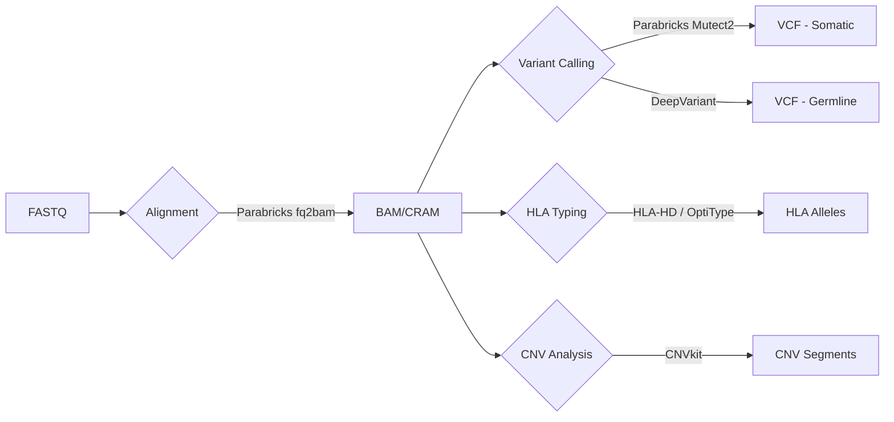
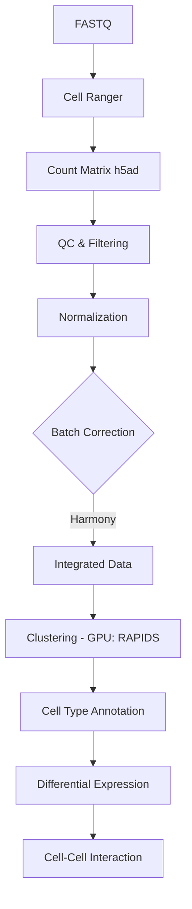
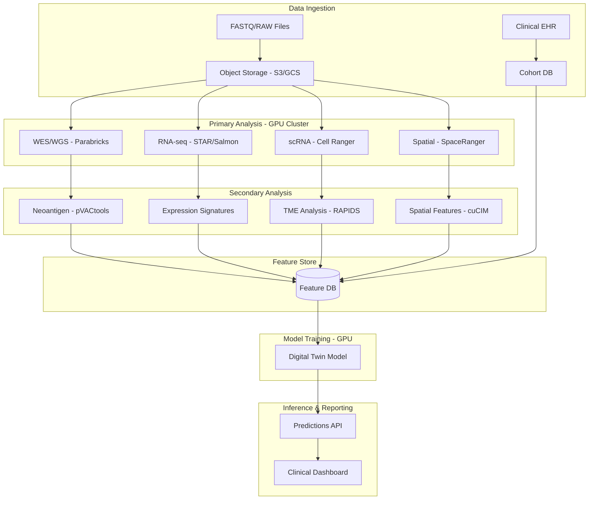

# Preliminary Pipeline: MHC-centric Digital Twin for Oncology

## Overview
This document outlines the technical requirements and architecture for the data processing pipeline designed for neoantigen detection. It details data acquisition, computational resources (RAM, storage, compute time), datasets, and software tools required for building an MHC-centric digital twin.

## Initial Datasets
*   **DNA Level**: Tumor + Normal (Whole Exome Sequencing / Whole Genome Sequencing)
*   **RNA Level**: Bulk sequencing, Single-cell sequencing, Spatial transcriptomics
*   **Repertoire**: TCR/BCR repertoire
*   **Clinical Data**: EHR, PET scans
*   **Proteomics**: Ligandome

---

## Pipeline Steps

---

### 1. Cohort and Metadata Ingestion

**Objective**: Define the cohort and maintain correct metadata for acquired data.

#### Data Sources
Clinical databases/trial registries (ClinicalTrials.org), pathology reports, EHR.
*   *Required Fields*: Demographics, therapy, outcomes (OS, PFS), pathology reports, biopsies, response metrics.

#### Technical Requirements
| Metric | Value |
| :--- | :--- |
| **Data Size** | 1-10 MB per report (may include biopsy images) |
| **Compute Time** | ~1 minute |
| **Disk Storage** | ~1 GB (compressed, versioned backups) |
| **RAM** | 2-4 GB |


#### State-of-the-Art Libraries & Tools
| Tool | Purpose | Notes |
| :--- | :--- | :--- |
| **Pandas / Polars** | Data wrangling | Polars for larger-than-memory datasets. **Selected for local/simple wrangling.** |
| **Great Expectations** | Data validation | Schema enforcement, data quality checks. |
| **DuckDB** | Lightweight analytics | Embedded OLAP database for fast queries. |
| **Nextflow** | Workflow orchestration | **Primary Choice**. Handles containers/cloud batch/hybrid. |
| **AWS HealthOmics** | Managed Omics Storage/Workflow | **Selected Cloud Service** if AWS is chosen. |

#### Compute Recommendation
| Aspect | Recommendation |
| :--- | :--- |
| **Hardware** | ✅ **CPU** (sufficient) |
| **Cloud vs. On-Prem** | Either. Cloud preferred for collaboration & scalability. |
| **Recommended Cloud** | **GCP BigQuery** (for analytics), **AWS S3 + Athena**, **AWS HealthOmics** |


> [!TIP]
> For EHR data specifically, consider FHIR-compliant data stores like **Google Cloud Healthcare API** or **Azure API for FHIR**.

#### Follow Up & Answers
*   **1) What about AWS HealthOmics?**
    *   **Answer**: AWS HealthOmics is a strong contender. It provides managed storage for generic omics data (FASTQ, BAM, CRAM) and runs workflows (Nextflow/WDL) without managing underlying EC2 instances. It is a direct competitor to the GCP Terra ecosystem.
*   **2) Does GCP Healthcare API support HIPAA laws, APP laws, Confidentiality laws, FTC laws, HITECH laws, GLBA laws?**
    *   **Answer**: Yes. GCP Healthcare API is **HIPAA** and **HITECH** compliant and is covered under the Google Cloud Business Associate Agreement (BAA). It supports compliance with **GLBA** (security standards). Regarding **FTC** health breach rules, the platform provides the necessary security features, though compliance depends on the application developer.

*   **Comment**: "We might not even require S3 or GCP, wrangling easy on Pandas, promoting unstructured data into structured format. Not used Cloud services in the past."
    *   **Resolution**: **Pandas** is selected for data wrangling. Cloud object storage (S3/GCS) is still recommended for raw sequencing data (WGS/WES) backup due to size (>100GB/sample), but initial processing can remain local if hardware permits.

---

### 2. WES/WGS – Variant Calling and HLA Typing

**Objective**: Define somatic variants, copy number variations (CNV), and HLA typing from paired DNA sequencing data. Focus on somatic mutations as potential neoantigen sources.

#### Data Sources
Paired DNA-seq FASTQ (Hospitals, GEO Omnibus, cBioPortal).

#### Technical Requirements
| Metric | Value |
| :--- | :--- |
| **Data Size** | Ref Genome: 3 GB, WES: 2-8 GB/sample, WGS: ~100 GB/sample, BAM/CRAM: ~50-100 GB |
| **Compute Time** | WES: 2-6h (16 vCPU), WGS: 12-18h (32 vCPU), HLA: ~30m/sample |
| **Disk Storage** | CRAMs: ~20 GB (compressed), VCF: ~200 MB |
| **RAM** | > 32 GB (64 GB recommended for WGS) |


#### State-of-the-Art Libraries & Tools
| Tool | Purpose | GPU-Accelerated? |
| :--- | :--- | :--- |
| **NVIDIA Clara Parabricks** | Full FASTQ-to-VCF pipeline | ✅ **Yes** (Selected for Speed). Includes GATK/DeepVariant. |
| **BWA-MEM2 / Minimap2** | Alignment | ❌ CPU-only |
| **GATK4 (Mutect2)** | Somatic variant calling | ❌ CPU (Parabricks has GPU version). **Biologist Preferred.** |
| **DeepVariant** | Germline variant calling | ✅ **Yes** (GPU/TPU) |
| **CNVkit** | Copy Number Variation | ❌ CPU |
| **HLA-HD / OptiType** | HLA Typing | ❌ CPU |
| **FastQC / MultiQC** | Quality Control | ❌ CPU |
| **Trimmomatic / fastp** | Adapter Trimming | ❌ CPU (fastp is faster) |

#### Follow Up & Answers
*   **1) Does NVIDIA Clara Parabricks require licensing?**
    *   **Answer**: The container itself is free to download and use for research, but **Enterprise Support** requires a paid NVIDIA AI Enterprise license. "Free" use is community-supported.
*   **2) AWS Healthomics vs Parabricks + GPU costs - Cost comparison?**
    *   **Answer**: **Parabricks is often cheaper.** While GPU instances (A100/V100) have a high hourly rate, Parabricks finishes the job in usually <1 hour (vs 24+ hours on CPU). AWS HealthOmics charges per run/Gigabase, which provides predictability, but optimized Parabricks pipelines on Spot instances are generally the most cost-effective high-performance option.
*   **3) Which of this tools is already captured in Parabricks / Healthomics?**
    *   **Answer**: **Parabricks** includes BWA-MEM, GATK (HaplotypeCaller, Mutect2), DeepVariant, and CNVkit. **HealthOmics** runs WDL/Nextflow workflows so it can run *any* tool, but provides "Ready2Run" workflows for GATK and AlphaFold.
*   **4) We might have to add SNP analysis and Quality check analysis (Trimomatic...)**
    *   **Resolution**: Added **FastQC** and **Trimmomatic** (or **fastp**) to the tool list.
*   **5) Is there a solution from GCP like AWS Healthomics? - Strides?**
    *   **Answer**: **GCP Terra** is the equivalent platform (workflow execution + data repo). Strides is an NIH funding/data partnership, not a software tool.
*   **6) The pipeline produces VCF but we need expression analysis**
    *   **Answer**: VCF files (DNA mutations) and Expression Matrices (RNA-seq counts) are separate outputs from parallel pipelines. They are integrated during the **Feature Engineering** step.
*   **7) FastQC -> Trimomatic -> FastQC -> Analysis**
    *   **Resolution**: This is the correct standard workflow. Consider **fastp** which performs QC and Trimming in a single pass for efficiency.

*   **Comment**: "Susmitha likes GATK4 - confidence scores, biologically makes more sense. Quality control"
    *   **Resolution**: **GATK4 (Mutect2)** is retained as a primary choice (via Parabricks or CPU) to ensure confidence scores match biologist expectations.


#### Compute Recommendation
| Aspect | Recommendation |
| :--- | :--- |
| **Hardware** | ⭐ **GPU strongly recommended** (NVIDIA A100/H100 with Parabricks) |
| **Cloud vs. On-Prem** | **Cloud preferred** for burst capacity and GPU access. |
| **Recommended Cloud** | **GCP** (Terra.bio integration, native Parabricks support), **AWS** (ParallelCluster + Parabricks), **Azure** (CromwellOnAzure) |

> [!IMPORTANT]
> **NVIDIA Clara Parabricks** is the most impactful acceleration here. It can reduce a 30-hour WGS pipeline to under 1 hour on a single A100 GPU, dramatically cutting costs and time.



---

### 3. Bulk RNA-seq: Expression and Antigen Presentation Signature

**Objective**: Extract expression matrices per gene and derive MHC presentation signatures. Output should include MHC-I/II scores, antigen processing machinery scores, and defect scores.

#### Data Sources
FASTQs from collaborating labs, hospitals, GEO Omnibus.

#### Technical Requirements
| Metric | Value |
| :--- | :--- |
| **Data Size** | FASTQ: 10 GB/sample, Internal BAM: 200 MB, Expression Matrix: 1 GB |
| **Compute Time** | 1-2 hours (16 vCPU) |
| **Disk Storage** | BAM: ~4 GB (compressed), Expression Matrix: 1-2 GB |
| **RAM** | > 32 GB per node |


#### State-of-the-Art Libraries & Tools
| Tool | Purpose | GPU-Accelerated? |
| :--- | :--- | :--- |
| **STAR** | Splice-aware alignment | ❌ CPU (Selected for accuracy) |
| **Salmon** | Pseudoalignment | ❌ CPU (Selected for quantification speed) |
| **PyDESeq2** | Differential expression | ❌ CPU (Python) |
| **DESeq2 / Limma** | Differential expression | ❌ CPU (**R-based** - Widely used) |
| **TIDE** | Antigen presentation signature | ❌ CPU |

#### Compute Recommendation
| Aspect | Recommendation |
| :--- | :--- |
| **Hardware** | ✅ **CPU** (high-memory nodes, 32-64 GB RAM) |
| **Cloud vs. On-Prem** | Either. Cloud for scalability across many samples. |
| **Recommended Cloud** | **AWS Batch**, **GCP Life Sciences API** (formerly Pipelines API), **Azure Batch** |

> [!NOTE]
> Bulk RNA-seq is largely CPU-bound. Biologists often prefer **STAR** for alignment quality and **DESeq2** (R) for statistical rigor.

#### Follow Up & Answers
*   **1) Use existing data available in the repository.**
    *   **Resolution**: Noted. Pipeline will accept local paths.
*   **2) PyDESeq2 is good... Most of the tools are in R...**
    *   **Resolution**: We will adopt a **Hybrid Approach**. Use **Nextflow** to orchestrate. Heavy lifting (alignment) in CLI tools. Stats/DE in **R (DESeq2)** via containers. Downstream ML in Python.
*   **3) Current pipeline is sequencing data -> qc -> expression -> expression qc -> downstream.**
    *   **Resolution**: Workflow confirms: FastQC -> STAR/Salmon -> Count Matrix -> QC (PCA/RLE) -> DESeq2 -> Downstream.

---

### 4. Neoantigen Prediction

**Objective**: Filter and generate neoantigens from VCF files and RNA-seq data.

#### Data Sources
VCF files, Expression matrix (RNA-seq), HLA types.

#### Technical Requirements
| Metric | Value |
| :--- | :--- |
| **Data Size** | ~300 MB input, ~500 MB output |
| **Compute Time** | 1-2 hours per sample |
| **Disk Storage** | 500 MB |
| **RAM** | 32 GB |

#### State-of-the-Art Libraries & Tools
| Tool | Purpose | GPU-Accelerated? |
| :--- | :--- | :--- |
| **pVACtools (pVACseq)** | Full neoantigen prediction pipeline | ❌ CPU |
| **MHCflurry 2.0** | MHC-I binding prediction | ✅ **Yes** (TensorFlow) - **Primary Choice** |
| **VEP (Ensembl)** | Variant annotation | ❌ CPU |
| **NVIDIA BioNeMo** | Protein language models for immunogenicity | ✅ **Yes** (foundation models) |

#### Compute Recommendation
| Aspect | Recommendation |
| :--- | :--- |
| **Hardware** | ✅ **CPU** for classical tools; **GPU** for MHCflurry and BioNeMo models |
| **Cloud vs. On-Prem** | Cloud beneficial for scaling across cohorts. |
| **Recommended Cloud** | **GCP (Vertex AI)** for BioNeMo/LLM inference, **AWS EC2** for pVACtools |


#### Follow Up & Answers
*   **1) people are still creating transformers models... tailored to labs...**
    *   **Resolution**: Acknowledge that off-the-shelf tools might need fine-tuning. **MHCflurry** allows re-training on custom datasets.
*   **2) Papers shared by Akash sir is great for MHC prediction.**
    *   **Resolution**: Will prioritize literature-backed tools (MHCflurry, NetMHCpan if license permits).

#### Action Items Strategy
*   **Integration**: Create a central Feature Store (Step 9) to unify VCF, RNA, and Clinical data.
*   **Custom Models**: Start with **MHCflurry 2.0** (Open Source, Retrainable). If solid tumor heterogeneity is high, fine-tune the model using the **Ligandome (MS)** data from the specific tumor type.
*   **Target**: Solid tumors (Ovarian, NSCLC, Liver) where neoantigen burden is often key.

> [!TIP]
> **MHCflurry 2.0** is the recommended primary predictor. It is open-source (Apache 2.0), GPU-accelerated, and integrates natively into Python pipelines, avoiding the licensing issues of NetMHCpan.

```mermaid
graph LR
    A[VCF + HLA Types] --> B[Variant Annotation]
    B -->|VEP / ANNOVAR| C[Annotated Variants]
    C --> D[Peptide Generation]
    D --> E{MHC Binding Prediction}
    E -->|NetMHCpan| F[Binding Affinity]
    E -->|MHCflurry (GPU)| F
    F --> G[Filter by Expression]
    G --> H[Ranked Neoantigens]
```

---

### 5. TCR/BCR Sequencing

**Objective**: TCR/BCR reconstruction and clonality metrics. Drives TCR diversity analysis and recognition of high-affinity neoantigens.

#### Data Sources
Bulk RNA-seq data, Dedicated TCR-seq/BCR-seq (e.g., 10x VDJ).

#### Technical Requirements
| Metric | Value |
| :--- | :--- |
| **Data Size** | 50 MB - 2 GB depending on depth |
| **Compute Time** | 1 hour per sample |
| **Disk Storage** | 1 GB per sample |
| **RAM** | 16-32 GB |

#### State-of-the-Art Libraries & Tools
| Tool | Purpose | GPU-Accelerated? |
| :--- | :--- | :--- |

#### State-of-the-Art Libraries & Tools
| Tool | Purpose | GPU-Accelerated? |
| :--- | :--- | :--- |
| **MiXCR** | TCR/BCR assembly from any seq data | ❌ CPU (**Primary Choice**) |
| **immunarch** | TCR analysis in R | ❌ CPU (**Selected for R analysis**) |
| **Scirpy** | TCR analysis in Python | ❌ CPU (Python-native) |
| **DeepTCR** | Deep learning TCR analysis | ✅ **Yes** (TensorFlow/Keras) |

#### Follow Up & Answers
*   **1) Predominantly, We will get TCR/BCR data from Genomic data and RNA seq...**
    *   **Resolution**: **MiXCR** is the best tool for extracting TCRs from mixed RNA-seq/WES data.
*   **2) What is the R tool that is predominantly used for TCR/BCR analysis?**
    *   **Answer**: **immunarch** and **scRepertoire** are the leading R packages.
*   **3) In Spatial analysis, we might need GPU or TPU**
    *   **Answer**: Correct. Spatial transcriptomics (especially image segmentation) is heavy on GPU usage.

---

### 6. scRNA-seq – Immune and Tumor Microenvironment

**Objective**: Single-cell processing, cell type annotation, and cell-cell interaction analysis. Helps acquire patient-centric CD8, CD4, immune/stromal cell profiles, and MHC expression relevance.

#### Data Sources
FASTQ from scRNA-seq, CITE-seq.

#### Technical Requirements
| Metric | Value |
| :--- | :--- |
| **Data Size** | ~2-4 GB per patient (h5ad format) |
| **Compute Time** | Cell Ranger: 1-2h (32 vCPU), Downstream: 3h |
| **Disk Storage** | 2-4 GB (FASTQ + h5ad) |
| **RAM** | 64-128 GB |

#### State-of-the-Art Libraries & Tools
| Tool | Purpose | GPU-Accelerated? |
| :--- | :--- | :--- |
| **Cell Ranger** | 10x Genomics preprocessing | ❌ CPU |
| **Scanpy** | Core single-cell analysis | Partial (via RAPIDS) |
| **RAPIDS-singlecell (NVIDIA)** | GPU-accelerated scanpy | ✅ **Yes** |
| **scVI / scANVI** | Variational inference, integration | ✅ **Yes** (PyTorch) |
| **Scrublet** | Doublet detection | ❌ CPU |
| **CellTypist** | Cell type annotation | ❌ CPU |
| **Squidpy (Graph)** | Cell-cell interaction | ❌ CPU |

#### Compute Recommendation
| Aspect | Recommendation |
| :--- | :--- |
| **Hardware** | ⭐ **GPU recommended** for large cohorts (RAPIDS, scVI) |
| **Cloud vs. On-Prem** | **Cloud preferred** for high-memory and GPU instances. |
| **Recommended Cloud** | **GCP** (high-mem instances, integrated with Terra), **AWS** (p4d/p5 instances) |

> [!IMPORTANT]
> **NVIDIA RAPIDS-singlecell** can accelerate clustering, dimensionality reduction, and neighbor graph construction by 10-100x on datasets with millions of cells.



---

### 7. Spatial Transcriptomics

**Objective**: Spatial processing to derive spatial gradients of MHC-I/II expression and T-cell infiltrates. Provides region-level features for the digital twin.

#### Data Sources
Visium, VisiumHD, CosMx, Xenium, H&E images, segmentation output.

#### Technical Requirements
| Metric | Value |
| :--- | :--- |
| **Data Size** | FASTQ+Image: 20 GB, Spatial Matrix: 5 GB, H&E: 0.5 GB |
| **Compute Time** | 4 hours per slide (32 vCPU) |
| **Disk Storage** | 10 GB per sample |
| **RAM** | > 128 GB |


#### State-of-the-Art Libraries & Tools
| Tool | Purpose | GPU-Accelerated? |
| :--- | :--- | :--- |
| **Space Ranger** | 10x Visium preprocessing | ❌ CPU |
| **Squidpy** | Spatial analysis in Python | Partial (image processing) |
| **cell2location** | Spatial deconvolution | ✅ **Yes** (PyTorch) - Maps scRNA to Visium |
| **Bin2Cell** | HD Spot Segmentation | ❌ CPU - **Selected** for Visium HD cell recovery |
| **NVIDIA cuCIM** | GPU image I/O & processing | ✅ **Yes** |
| **StarDist / Cellpose** | Cell segmentation | ✅ **Yes** (TensorFlow/PyTorch) |

#### Follow Up & Answers
*   **1 & 2) Spaceranger/Cellranger plus Nextflow gives you parallelization.**
    *   **Resolution**: Confirmed. Nextflow is the chosen orchestrator.
*   **3) Squidpy is good, but I use Scipy.**
    *   **Resolution**: Squidpy is built on Scipy but adds spatial-specific stats. Can use both.
*   **4) Stardist for cell segmentation**
    *   **Resolution**: **StarDist** selected for segmentation.
*   **5) Bin2Cell - Aggregate bins into cellular components - Visium data. How is cell2location playing a role here?**
    *   **Answer**: **Bin2Cell** is for *reconstructing* single cells from high-res (Visium HD) bins by using image segmentation. **cell2location** is for *deconvolution* (predicting cell type proportions in larger spots using an scRNA reference). They are complementary steps depending on resolution.
*   **6) Do we need MONAI? Probably not.**
    *   **Resolution**: Removed MONAI.

> [!IMPORTANT]
> **NVIDIA cuCIM** is essential for handling large whole-slide images (WSI). Paired with **MONAI** or **Cellpose**, GPU-based segmentation is orders of magnitude faster.

---

### 8. Ligandome (Immunopeptidomics)

**Objective**: Identify MHC ligands via Mass Spectrometry to confirm which predicted neoantigens are actually presented.

#### Data Sources
Mass Spec RAW files from MHC pull-downs (IP-MS).

#### Technical Requirements
| Metric | Value |
| :--- | :--- |
| **Data Size** | 5-20 GB per experiment |
| **Compute Time** | 6 hours (32 vCPU) |
| **Disk Storage** | 10-50 GB |
| **RAM** | 64 GB |

#### State-of-the-Art Libraries & Tools
| Tool | Purpose | GPU-Accelerated? |
| :--- | :--- | :--- |
| **MaxQuant** | Peptide identification | ❌ CPU |
| **MSFragger** | Ultra-fast database search | ❌ CPU (highly optimized) |
| **Comet / X!Tandem** | Open-source search engines | ❌ CPU |
| **Percolator** | PSM rescoring | ❌ CPU |
| **NetMHCpan (validation)** | Validate that peptides bind predicted HLA | ❌ CPU |
| **MHCquant** | Specialized immunopeptidomics pipeline | ❌ CPU |
| **OpenMS** | LC-MS/MS analysis framework | ❌ CPU |
| **AlphaPeptDeep** | Deep learning for MS-based proteomics | ✅ **Yes** (PyTorch) |

#### Compute Recommendation
| Aspect | Recommendation |
| :--- | :--- |
| **Hardware** | ✅ **CPU** (MSFragger is very fast); **GPU** for AlphaPeptDeep |
| **Cloud vs. On-Prem** | On-prem often preferred for MS data due to size and instrument proximity. |
| **Recommended Cloud** | **AWS EC2** (compute-optimized instances for MSFragger) |

> [!NOTE]
> Mass spectrometry workflows are typically CPU-bound but highly parallelizable. **MSFragger** is the current speed champion for database searches.

---

## Downstream Processing

---

### Feature Engineering

**Objective**: Aggregate outputs from all upstream pipelines, remove derived/correlated features, perform dimensionality reduction (PCA), and prepare patient-level feature vectors for the Digital Twin model.

#### Data Sources
Outputs from DNA, RNA, TCR, scRNA, Spatial, and Peptidome pipelines.

#### Technical Requirements
| Metric | Value |
| :--- | :--- |
| **Data Size** | 20 GB (aggregated) |
| **Compute Time** | 2-4 hours |
| **Disk Storage** | 10 GB |
| **RAM** | Up to 128 GB (for graph reconstruction) |

#### State-of-the-Art Libraries & Tools
| Tool | Purpose | GPU-Accelerated? |
| :--- | :--- | :--- |
| **Pandas / Polars** | Data manipulation | ❌ CPU (Polars is much faster) |
| **NVIDIA RAPIDS (cuDF, cuML)** | GPU DataFrames & ML | ✅ **Yes** |
| **Feast** | **Feature Store** | ❌ CPU (Manages training/serving skew) |
| **PyTorch Geometric / DGL** | Graph neural networks | ✅ **Yes** |

#### Compute Recommendation
| Aspect | Recommendation |
| :--- | :--- |
| **Hardware** | ⭐ **GPU recommended** for RAPIDS and GNNs |
| **Cloud vs. On-Prem** | Cloud preferred for GPU access. |
| **Recommended Cloud** | **GCP Vertex AI**, **AWS SageMaker** |

---

### DT Model Training

**Objective**: Train the Digital Twin predictive models (e.g., immune response prediction, treatment outcome, neoantigen prioritization).

#### Technical Requirements
| Metric | Value |
| :--- | :--- |
| **Data Size** | Variable (patient feature matrices) |
| **Compute Time** | Hours to days depending on model |
| **RAM** | 64-256 GB |

#### State-of-the-Art Libraries & Tools
| Tool | Purpose | GPU-Accelerated? |
| :--- | :--- | :--- |
| **PyTorch / TensorFlow** | Deep learning frameworks | ✅ **Yes** |
| **PyTorch Geometric / DGL** | Graph Neural Networks | ✅ **Yes** |
| **XGBoost / LightGBM** | Gradient boosting | ✅ **Yes** (GPU training) |
| **Hugging Face Transformers** | Transformer models | ✅ **Yes** |
| **NVIDIA BioNeMo** | Foundation models for drug discovery | ✅ **Yes** |
| **MLflow / Weights & Biases** | Experiment tracking | N/A |
| **Optuna / Ray Tune** | Hyperparameter optimization | GPU compatible |

#### Compute Recommendation
| Aspect | Recommendation |
| :--- | :--- |
| **Hardware** | ⭐ **Hybrid**: **GPUs** for GNNs/Standard DL; **TPUs** for JAX-based Foundation Models |
| **Cloud vs. On-Prem** | **Cloud preferred** for access to latest accelerators. |
| **Recommended Cloud** | **GCP Vertex AI** (Best for TPU access), **AWS SageMaker** |

> [!IMPORTANT]
> **Strategic Choice**: If building a custom foundation model (e.g., "BERT for Immunology") using DeepMind's stack (JAX/Haiku), **TPUs** are the superior choice for scale. For Graph Neural Networks (GNNs) or standard PyTorch workflows, **NVIDIA GPUs** are preferred.

---

### Downstream Analysis

**Objective**: Interpret model outputs, generate reports, and create visualizations for clinical decision support.

#### State-of-the-Art Libraries & Tools
| Tool | Purpose |
| :--- | :--- |
| **Matplotlib / Seaborn / Plotly** | Visualization |
| **Streamlit / Gradio** | Interactive dashboards |
| **SHAP / Captum** | Model interpretability |
| **Jupyter / Quarto** | Reproducible reports |

#### Compute Recommendation
| Aspect | Recommendation |
| :--- | :--- |
| **Hardware** | ✅ **CPU** (sufficient) |
| **Cloud vs. On-Prem** | Either. |
| **Recommended Cloud** | App hosting: **GCP Cloud Run**, **AWS App Runner** |

---

## Infrastructure Summary

| Pipeline Step | Compute | GPU Benefit | Recommended Cloud |
| :--- | :---: | :---: | :--- |
| 1. Cohort & Metadata | CPU | ❌ None | GCP, AWS, Azure |
| 2. WES/WGS | **GPU** | ⭐⭐⭐ (Parabricks: 30x faster) | **GCP (Terra)**, AWS |
| 3. Bulk RNA-seq | CPU | ❌ None | AWS Batch, GCP |
| 4. Neoantigen Prediction | CPU/GPU | ⭐ (MHCflurry) | GCP, AWS |
| 5. TCR/BCR | CPU | ⭐ (DeepTCR) | AWS, GCP |
| 6. scRNA-seq | **GPU** | ⭐⭐⭐ (RAPIDS 10-100x) | **GCP**, AWS |
| 7. Spatial | **GPU** | ⭐⭐⭐ (cuCIM, segmentation) | **GCP (A100)**, AWS |
| 8. Ligandome | CPU | ⭐ (AlphaPeptDeep) | AWS |
| Feature Engineering | GPU | ⭐⭐ (RAPIDS) | GCP, AWS |
| DT Model Training | **GPU / TPU** | ⭐⭐⭐ (TPU for JAX models) | **GCP (Vertex AI)**, AWS |
| Downstream Analysis | CPU | ❌ None | Any |

---

## Recommended Overall Architecture



---

## Cloud Provider Comparison

| Feature | GCP | AWS | Azure |
| :--- | :--- | :--- | :--- |
| **Genomics Platform** | Terra.bio (Broad) | AWS HealthOmics | Microsoft Genomics |
| **Parabricks Support** | ✅ Native on Terra | ✅ Via ParallelCluster | ✅ Via Batch |
| **GPU Instances** | A100, H100, TPU v5 | A100, H100 (p4d, p5) | A100, H100 (ND series) |
| **ML Platform** | Vertex AI | SageMaker | Azure ML |
| **HIPAA Compliance** | ✅ | ✅ | ✅ |
| **Best For** | Genomics & ML | General compute & scale | Enterprise integration |

> [!TIP]
> For an oncology-focused pipeline, **GCP with Terra.bio** offers the best integration with genomics tools (Cromwell, WDL, Parabricks) and a strong ML platform (Vertex AI). AWS is a strong alternative with broader compute options.

---


## Architectural Decisions & Tool Strategy

This pipeline prioritizes **flexibility**. While Python is the preferred glue for Machine Learning, we acknowledge the power of **R** in bioinformatics statistics.

| Component | Tool Choice | Reason |
| :--- | :--- | :--- |
| **Orchestration** | **Nextflow** | Industry standard, handles containers (Docker/Singularity), scales to cloud. |
| **Language** | **Python (Primary) + R (secondary)** | Python for ML/Deep Learning. R for verified statistical packages (DESeq2, Limma). |
| **scRNA-seq** | **Scanpy & Seurat** | **Scanpy** for large-scale integration/ML. **Seurat** (R) for specific biological workflows. |
| **Bulk RNA** | **DESeq2 (R) / PyDESeq2** | DESeq2 is the gold standard for differential expression. |
| **TCR/BCR** | **MiXCR + immunarch** | Mixed language approach for best assembly and visualization. |
| **Spatial** | **Squidpy + Bin2Cell** | Best-in-class Python tools for spatial statistics and HD reconstruction. |
| **Neoantigen** | **MHCflurry 2.0** | GPU-accelerated and license-friendly (Apache 2.0). |

#### Follow Up & Answers
*   **1) Seurat is good to have** -> **Added.**
*   **2) Scanpy is good for spatial and bulk** -> **Agreed**, used in pipeline.
*   **3) DESEq2 is good** -> **Added** as primary DE tool.
*   **4) Limma is good for R - Bulk RNA Seq** -> **Added** as alternative.